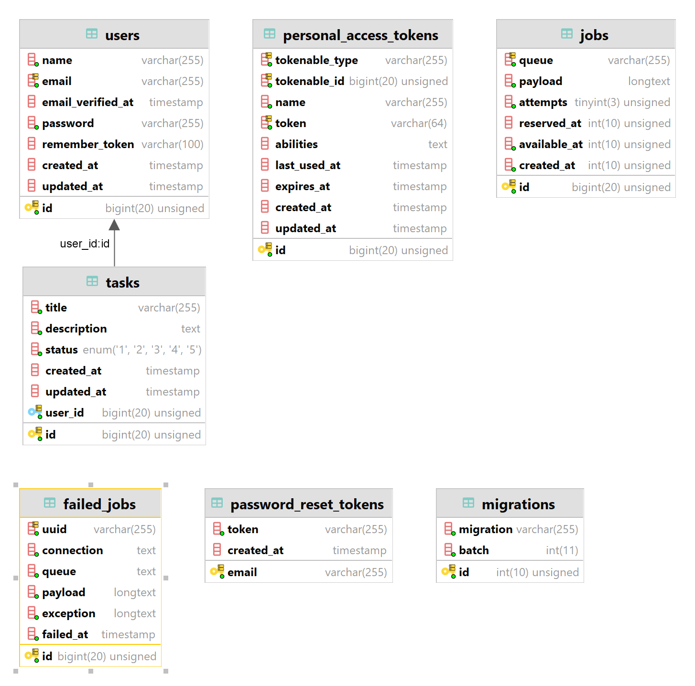

<h1 align="center">Task Manager REST API</h1>
<p align="center">

</p>
<p align="center">
	  <em>Simple REST API for task management system built with Laravel and MySQL</em>
</p>

## Table of Contents
* [About Task Manager REST API](#about-task-manager-rest-api)
* [Tech Stack](#tech-stack)
* [Prerequisites](#prerequisites)
* [Development setup](#development-setup)
* [Database ERD](#database-erd)
* [Example users already existing in the database](#example-users-already-existing-in-the-database)
* [License](#license)

## About Task Manager REST API

The Task Manager REST API enables users to create, update, view, and delete tasks. Each task includes a title, description, creation date, update date, and status (1 - open, 2 - in progress, 3 - pending, 4 - closed, 5 - canceled). The API sends an email notification to the user when their task status changes and verifies the user's permissions for individual tasks.

## Tech Stack


## Prerequisites
1. PHP 8.1.16 minimum
2. Composer 2.4.4 minimum
4. MySQL 8.0 minimum

## Development setup

1. Prepare a new MySQL database instance

2. Clone the project and open a new terminal window inside the root directory of cloned project

```bash
  git clone https://github.com/krzychu12350/task_manager_rest_api.git
```

3. Install dependencies

```bash
  composer install
```

4. Copy the file '.env.example' and rename it to '.env', then configure it
to allow application connect with database and operate with a SMTP server allowing to send emails and set QUEUE_CONNECTION variable to database


5. Run migrations and seeders

```bash
  php artisan migrate --seed
```

6. Generate keys

```bash
  php artisan key:generate
```

7. Start the Laravel server

```bash
  php artisan serve
```

8. Open a new window or a new tab of terminal and execute following command

```bash
  php artisan queue:work
```

## Database ERD


## Example users already existing in the database

### First example user
Name: ```Tom Cruise```<br>
Email Address: ```t.cruise@gmail.com```<br>
Password: ```tCruise12?3```<br>

### Second example user
Name: ```Mark Black```<br>
Email Address: ```m.black@gmail.com```<br>
Password: ```mBlack12?3```<br>

## License
MIT
